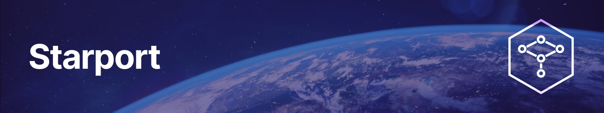

# 

Starport is the easiest way to build a blockchain. It is a developer-friendly interface to the [Cosmos SDK](https://github.com/cosmos/cosmos-sdk), the world's most widely-used blockchain application framework. Starport generates boilerplate code for you, so you can focus on writing business logic.

## Quick start

Open Starport [in your browser](https://gitpod.io/#https://github.com/tendermint/starport/tree/master), or [install it](/docs/1%20Introduction/2%20Install.md). Then:

```
starport app github.com/foo/mychain

cd mychain

starport serve
```

